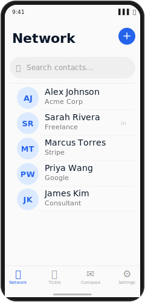
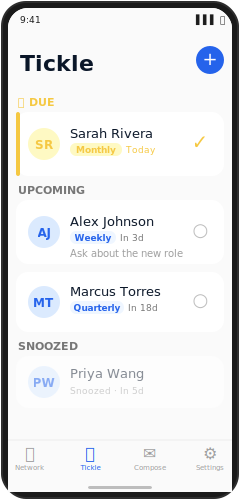
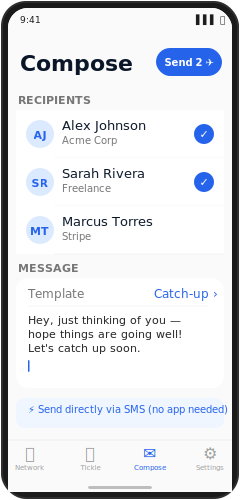

# Ticklr — Your People Matter

A privacy-first personal network manager for iOS and Android. Build your contact network, stay connected on your schedule with the tickle calendar, and send messages — all stored locally with no cloud, no account required.

## Screenshots

### iOS (Swift 6 · SwiftUI · SwiftData)

| Network | Tickle | Compose |
|:-------:|:------:|:-------:|
|  |  |  |

### Android (Kotlin · Jetpack Compose · Room)

| Network | Tickle | Compose |
|:-------:|:------:|:-------:|
|  |  |  |

## Repository Structure

```
sit/
├── ios/          — Native Swift 6 / SwiftUI / SwiftData (iOS 17+)
├── android/      — Native Kotlin / Jetpack Compose / Room (Android 8+)
├── assets/
│   └── brand/    — Shared logo SVGs, color palette, design tokens
├── CLAUDE.md     — Top-level Claude Code context
└── README.md
```

## Philosophy
- Everything on-device — zero cloud sync required
- Import contacts from phone or LinkedIn CSV export
- Tickle calendar: recurring reminders to reach out on your schedule
- Send via native SMS/MMS — no third-party messaging

## Platforms

| Platform | Language | UI | Persistence | Min Version |
|---|---|---|---|---|
| iOS | Swift 6 | SwiftUI | SwiftData | iOS 17 |
| Android | Kotlin | Jetpack Compose | Room | Android 8 (API 26) |

## Brand

**Pulse identity** — Navy `#0A1628` · Cobalt `#2563EB` · Amber `#F5C842`
Wordmark: Syne 800 — "SIT" + "STAY IN TOUCH"
See `assets/brand/` for logo sources.

## Getting Started

### iOS
```bash
cd ios
brew install xcodegen
xcodegen generate
open SIT.xcodeproj
```

### Android
```bash
cd android
./gradlew assembleDebug
```
Or open `android/` in Android Studio.

## Roadmap
- [x] iOS scaffold + SwiftData models
- [x] Pulse brand identity + launch screen
- [x] iOS tickle calendar feature
- [x] Android scaffold + full feature parity
- [x] iOS contacts import (CNContactStore + LinkedIn CSV)
- [x] Android contacts import (ContactsContract + LinkedIn CSV)
- [ ] iCloud backup (iOS)
- [ ] Android backup
- [x] App Store submission
- [ ] Google Play submission

Built by [Xaymaca](https://xaymaca.com) — Build Smarter with AI.
