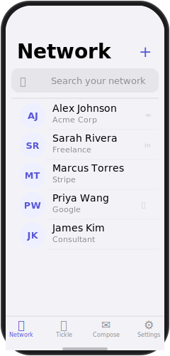
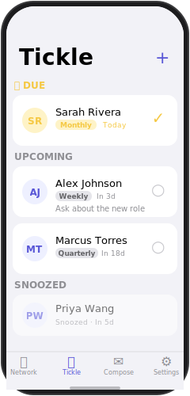
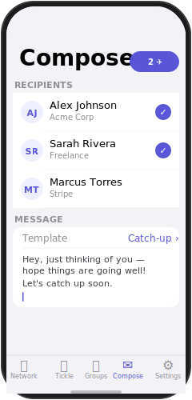

# Ticklr — Your People Matter

<p align="center">
  
</p>

<p align="center">
  A privacy-first iOS app for maintaining your most important relationships.<br/>
  No cloud. No analytics. No account required.
</p>

---

## What It Does

SIT helps you stay in touch with people who matter. Import your contacts, organize them into groups, set recurring "tickle" reminders, and send messages directly from the app — all on-device.

| Network | Tickle | Compose |
|:-------:|:------:|:-------:|
|  |  |  |

## Features

- **Network** — Searchable contact list. Import from iOS Contacts or LinkedIn CSV export.
- **Tickle** — Recurring reminders to reach out. Daily, weekly, monthly, or custom intervals. Local notifications at 9 AM on the due date.
- **Groups** — Organize contacts into labeled circles (Family, Work, Board, etc.). Contacts can belong to multiple groups.
- **Compose** — Multi-select contacts, pick a message template, and launch iMessage/SMS with one tap.
- **Templates** — Save reusable message drafts for quick sending.

## Privacy

All data is stored locally using SwiftData. Nothing leaves your device:

- No network requests
- No analytics or tracking
- No account or sign-in
- No third-party SDKs

## Tech Stack

| Layer | Technology |
|---|---|
| Language | Swift 6 (strict concurrency) |
| UI | SwiftUI |
| Persistence | SwiftData (iOS 17+) |
| Contacts import | CNContactStore |
| LinkedIn import | CSV via UIDocumentPickerViewController |
| Messaging | MessageUI (MFMessageComposeViewController) |
| Notifications | UNUserNotificationCenter (local only) |
| Min deployment | iOS 17.0 |

## Project Structure

```
Sources/SIT/
├── App/
│   ├── SITApp.swift
│   └── ContentView.swift
├── Models/
│   ├── Contact.swift
│   ├── ContactGroup.swift
│   ├── MessageTemplate.swift
│   └── TickleReminder.swift
├── Views/
│   ├── Network/          # Contact list, detail, add, group management
│   ├── Tickle/           # Tickle list, row, edit views
│   ├── Compose/          # Multi-select compose + template picker
│   ├── Onboarding/       # First-run flow + import
│   └── Settings/
└── Services/
    ├── ContactImportService.swift
    ├── LinkedInCSVParser.swift
    ├── MessageComposerService.swift
    └── TickleScheduler.swift
```

## Getting Started

```bash
brew install xcodegen
xcodegen generate
open SIT.xcodeproj
```

> **Note:** MFMessageComposeViewController requires a physical iPhone. The SMS sheet will not appear in Simulator.

## Importing Contacts

**From iOS Contacts** — tap **+** → Start Your Network in the Network tab. Requires Contacts permission (requested on first import).

**From LinkedIn** — export your connections from LinkedIn (Settings → Data Privacy → Get a copy of your data → Connections). Import the `Connections.csv` file via the + menu.

## Roadmap

- [x] v1: Core network + messaging + groups
- [x] v1.1: Tickle reminders with local notifications
- [ ] v2: iCloud backup of SwiftData store (tickles, templates, notes)
- [ ] v3: iOS Widgets for quick-text favorites
- [ ] v4: App Intents for Siri and Apple Intelligence actions

## License

MIT — open source, privacy-first, yours to fork.

Built by [Xaymaca](https://xaymaca.com) — Build Smarter with AI.
